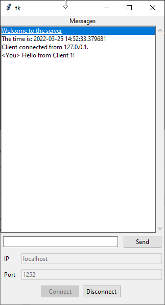
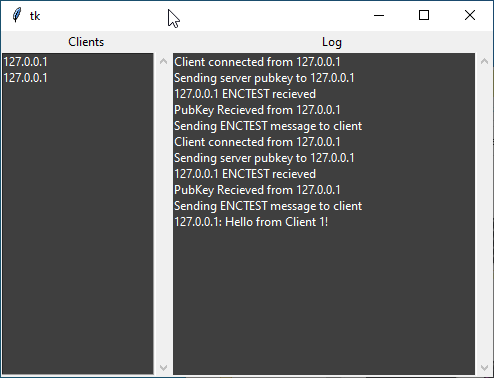

PySecChat
=========

Server/Client encrypted chat application

Usage
===========

To Use:

Run setup.py first
>python setup.py develop

To run the server - Port is 1252 by default
>python chat_server.py

To run the GUI Client

>python chat_client-gui.py

Notes
======
- Likely to be very unstable in its current state

- Connect to IP: 127.0.0.1, Port: 1252. to connect to the server when its running on your local machine
